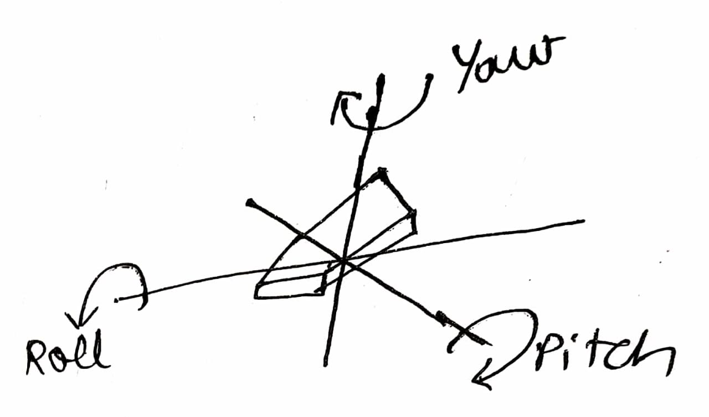
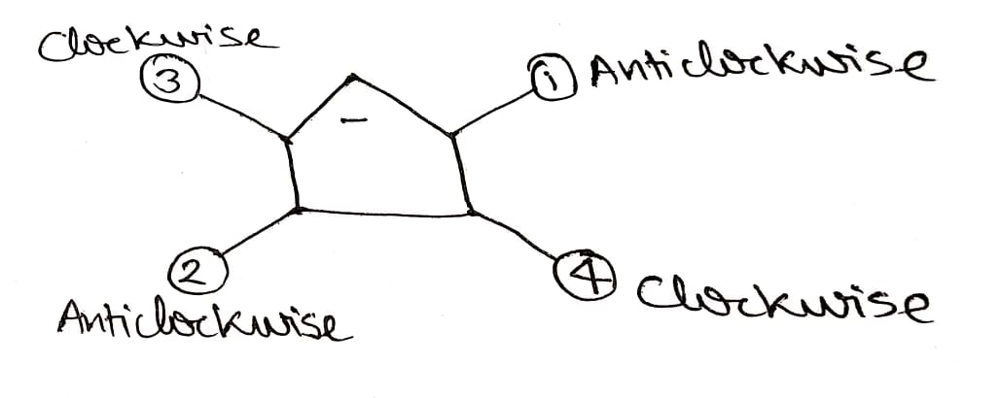

# Basic Controls Of Quadcopters

Yaw is for Heading Direction

Throttle is for Up-Down Moment

Roll is for Right-Left Moment

Pitch is for Forward-Backward Moment


> Forward Right is Anti-Clockwise for Quadcopters 
>
> Diagonals are same for Propellers


