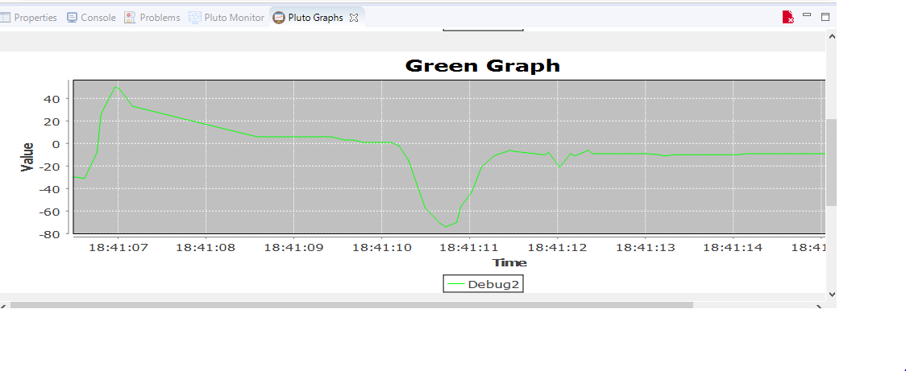

# Detect Up Down Motion Of Pluto X

```text
// Do not remove the include below
#include "PlutoPilot.h"
#include "Estimate.h" //gives access to drone rates, angles,velocities, positions
#include "utils.h" //gives you access to the LED,graphs, print

//The setup function is called once at Pluto's hardware startup
void plutoInit()
{
// Add your hardware initialization code here
}


//The function is called once before plutoLoop when you activate Developer Mode
void onLoopStart()
{
  // do your one time stuff here

	LED.flightStatus(DEACTIVATE); //disable LED behaviuour

}


// The loop function is called in an endless loop
void plutoLoop()
{

//Add your repeated code here
	if(Velocity.get(Z)>0) //if the drone is moving upwards velocity in z axis will be positive
	{
		LED.set(RED, OFF);
		LED.set(GREEN, ON);
	}
	else
	{
		LED.set(RED, ON);
		LED.set(GREEN, OFF);
	}

	Monitor.println("Velocity:",Velocity.get(Z));
	Graph.green(Velocity.get(Z), 3);

}


//The function is called once after plutoLoop when you deactivate Developer Mode
void onLoopFinish()
{

// do your cleanup stuffs here

}


```



