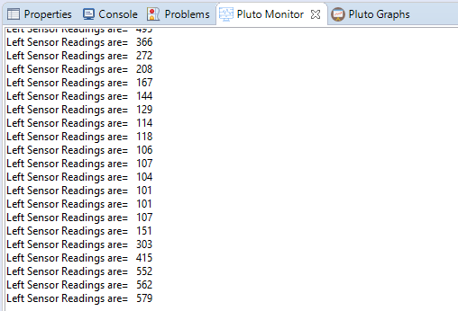

# Reading The Values From Laser Sensor

```text

// Do not remove the include below
#include "PlutoPilot.h"
#include "Sensor.h"
#include "Estimate.h"
#include "utils.h"
#include "User.h"
#include "Control.h"
#include "Motor.h"
#include "XRanging.h"

int16_t Range=0;

//The setup function is called once at Pluto's hardware startup
void plutoInit()
{
// Add your hardware initialization code here
	XRanging.init(LEFT);  //left sensors is initialized

}

//The function is called once before plutoLoop when you activate Developer Mode
void onLoopStart()
{
  // do your one time stuff here

	LED.flightStatus(DEACTIVATE); //disable LED behavior
}


// The loop function is called in an endless loop
void plutoLoop()
{

//Add your repeated code here
XRanging.getRange(LEFT); //will get left sensors values of drone

Monitor.println("Left Sensor Readings are=",Range);

}


//The function is called once after plutoLoop when you deactivate Developer Mode
void onLoopFinish()
{

// do your cleanup stuffs here

	LED.flightStatus(ACTIVATE);
}
```



