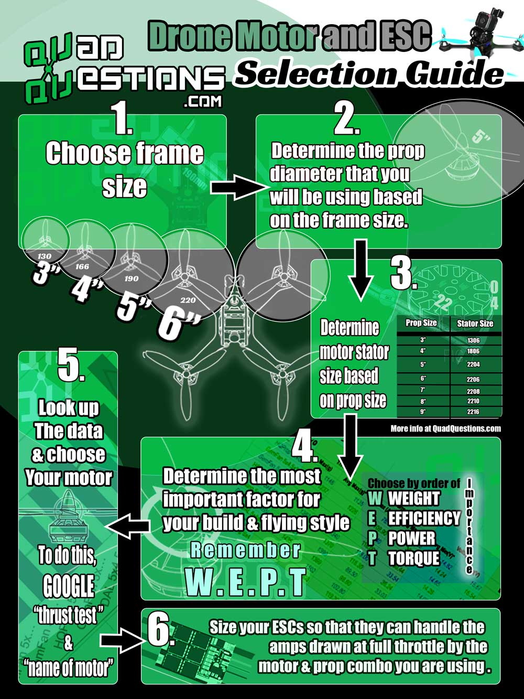

# Selection Guide For Building A Drone

1. Choose Frame Size
2. Determine the Propellers and its diameter
3. Determine Motor \(consumption and Rpm\)
4. Determine weight, efficiency, power, torque
5. Lookup data and choose the most suitable motor
6. Size your ESC\(Electronic Speed Controller\) , so that it can handle current from all motors of drone. Select little larger current setup for ESC as compared to all 4 motors


For referring motor selection check the exact configuration of voltage, current, max. and min. rpm

Refer this site's information on rpm and other guiding details

[https://emaxmodel.com/emax-rs2205-racespec-motor.html](https://emaxmodel.com/emax-rs2205-racespec-motor.html)


