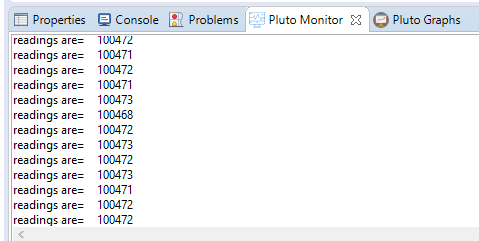
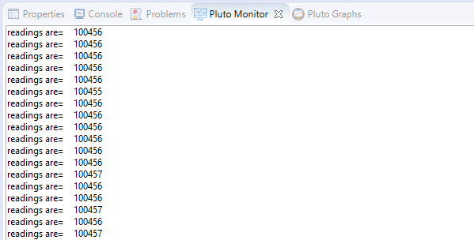

# Too See The Barometer Readings

```text

// Do not remove the include below
#include "PlutoPilot.h"
#include "Sensor.h"
#include "utils.h"

//The setup function is called once at Pluto's hardware startup
void plutoInit()
{
// Add your hardware initialization code here
}


//The function is called once before plutoLoop when you activate Developer Mode
void onLoopStart()
{
  // do your one time stuff here

	LED.flightStatus(DEACTIVATE); //disable LED behaviuour


}


// The loop function is called in an endless loop
void plutoLoop()
{

//Add your repeated code here
	int32_t readings =Barometer.get(PRESSURE);
	Monitor.println("readings are=",readings);
}


//The function is called once after plutoLoop when you deactivate Developer Mode
void onLoopFinish()
{

// do your cleanup stuffs here

	LED.flightStatus(ACTIVATE);

}
```





