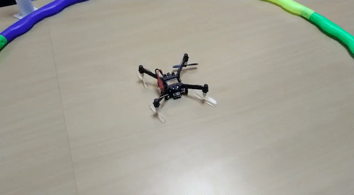

# Turtle Flip

```text

// Do not remove the include below
#include "PlutoPilot.h"
#include "Sensor.h"
#include "Estimate.h"
#include "utils.h"
#include "User.h"
#include "Control.h"
#include "Motor.h"

#define ABS(x) ((x) > 0 ? (x) : -(x))


//The setup function is called once at Pluto's hardware startup
void plutoInit()
{
// Add your hardware initialization code here
	Motor.initReversibleMotors();
}


//The function is called once before plutoLoop when you activate Developer Mode
void onLoopStart()
{
  // do your one time stuff here

	LED.flightStatus(DEACTIVATE); //disable LED behavior

	Motor.setDirection(M1, ANTICLOCK_WISE); //reverse motor direction
	Motor.setDirection(M2, CLOCK_WISE);
	Motor.setDirection(M3, ANTICLOCK_WISE);
	Motor.setDirection(M2, CLOCK_WISE);
}


// The loop function is called in an endless loop
void plutoLoop()
{

//Add your repeated code here

int16_t angle=Angle.get(AG_ROLL);
Monitor.println("Angle Reading are=",angle);

if(!FlightStatus.check(FS_ARMED)) //drone is armed or not
  {
	 if(ABS(angle)<1800 && ABS(angle)>800) //inverted or not
	 {
		 Motor.set(M1,2000);
		 Motor.set(M2,2000); //max input
	 }

	 else
	 {
		 Motor.set(M3,1000);  //min input
		 Motor.set(M4,1000);
		 Motor.set(M2,1000);
		 Motor.set(M1,1000);
	 }
  }

}


//The function is called once after plutoLoop when you deactivate Developer Mode
void onLoopFinish()
{

// do your cleanup stuffs here

	LED.flightStatus(ACTIVATE);

	 Motor.set(M3,1000);  //default value is applied
	 Motor.set(M4,1000);
	 Motor.set(M2,1000);
	 Motor.set(M1,1000);

		Motor.setDirection(M1, CLOCK_WISE); //default motor direction is applied
		Motor.setDirection(M2, ANTICLOCK_WISE);
		Motor.setDirection(M3, CLOCK_WISE);
		Motor.setDirection(M2, ANTICLOCK_WISE);
}
```



