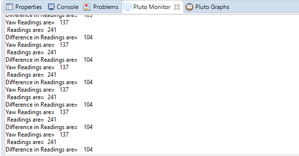

# Yaw 1

```text
// Do not remove the include below
#include "PlutoPilot.h"
#include "Estimate.h" //gives access to drone rates, angles,velocities, positions
#include "utils.h"
#include "User.h"

int16_t x=0;

//The setup function is called once at Pluto's hardware startup
void plutoInit()
{
// Add your hardware initialization code here
}


//The function is called once before plutoLoop when you activate Developer Mode
void onLoopStart()
{
  // do your one time stuff here

	LED.flightStatus(DEACTIVATE); //disable LED behaviuour

}


// The loop function is called in an endless loop
void plutoLoop()
{

//Add your repeated code here
x=App.getAppHeading();
Monitor.println("Yaw Readings are=",x);

int16_t reading=Angle.get(AG_YAW);
Monitor.println(" Readings are=",reading);

int16_t Diff=reading-x;
Monitor.println("Difference in Readings are=",Diff);

}


//The function is called once after plutoLoop when you deactivate Developer Mode
void onLoopFinish()
{

// do your cleanup stuffs here

	LED.flightStatus(ACTIVATE);
}
```



